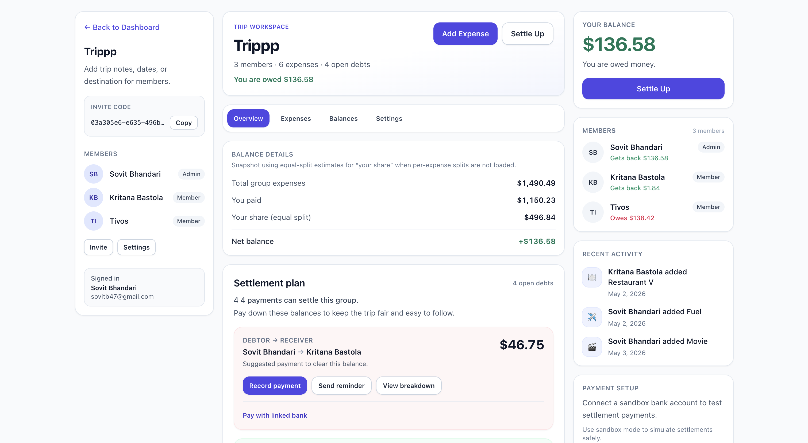

# SplitEase

A full-stack web app for **group expense splitting**-think trips, roommates, or any shared costs. People can create groups, log expenses, see balances, and work through a settlement plan so everyone knows who owes what.

I built this to practice end-to-end product work: a typed React UI, a real Postgres-backed API, auth, and real-time updates when group data changes.

---

## Demo



---

## What it does (high level)

- **Accounts** - Register, log in, JWT-based sessions.
- **Groups / trips** - Create a group, invite others with a code or shareable link, optional trip name & description.
- **Expenses** - Add amounts, split styles, categories; list updates with balances.
- **Balances & settlements** — See who’s up or down and a suggested settlement plan. Record **manual** payments (cash, Venmo, etc.) or, when enabled, start a **sandbox bank payment** that uses **Plaid Transfer** in **Sandbox** (no real money). Transfer status shows on settlement lines; **Payment history** lists Plaid transfer attempts and outcomes.
- **Live feel** - Socket updates so members see changes without refreshing everything by hand.

---

## Tech stack

| Layer               | Choices                                                              |
| ------------------- | -------------------------------------------------------------------- |
| Frontend            | React (Vite), TypeScript, Tailwind CSS, React Router, Zustand, Axios |
| Backend             | Node.js, Express, TypeScript, Zod, Socket.IO                         |
| Data                | PostgreSQL (raw SQL migrations), `pg`                                |
| Auth                | JWT + httpOnly cookies (see server code for details)                 |
| Payments (optional) | Plaid Link + Plaid Transfer (Sandbox-first; production-gated)        |

Monorepo layout: **`client/`** (UI), **`server/`** (API), **`db/`** (SQL migrations).

---

## Prerequisites

- **Node.js 20+** (matches the server `engines` field).
- **PostgreSQL** - easiest path here is Docker (see below). You can use your own instance; just set `DATABASE_URL` accordingly.
- **npm** (comes with Node).

Optional: **Docker Desktop** (or compatible engine) if you want the bundled Postgres from `docker-compose.yml`.

---

## Run it locally

### 1. Clone the repo

```bash
git clone <your-fork-or-repo-url>
cd SplitEase-Group-Expense-Splitting-Platform
```

### 2. Install dependencies (workspace root)

From the **repository root**:

```bash
npm install
```

This installs both `client` and `server` via npm workspaces.

### 3. Start PostgreSQL

**Option A — Docker (recommended for a quick setup)**

```bash
docker compose up -d db
```

This maps Postgres to host port **5433** (so it won’t fight another Postgres on 5432). Wait until the container is healthy.

**Option B — your own Postgres**

Create a database and user, then put the connection string in `DATABASE_URL` in the next step.

### 4. Environment variables

Copy the example env file and edit it:

```bash
cp server/.env.example server/.env
```

Open **`server/.env`** and set at least:

- **`DATABASE_URL`** — must match your Postgres (the example in `.env.example` matches the Docker Compose user/db/port **5433**).
- **`JWT_SECRET`** and **`JWT_REFRESH_SECRET`** — each must be **at least 32 characters** (the server validates this).
- **`ENCRYPTION_KEY`** — use a long random string (see comments in `.env.example`).

For a first run you can leave **Plaid** fields empty; core group/expense flows and **manual** settlement still work. To try **Plaid Link** or **Plaid Transfer** sandbox payments, set the Plaid and feature flags below (see [`server/.env.example`](server/.env.example) for the full list).

**Plaid-related (optional):**

- **`PLAID_CLIENT_ID`**, **`PLAID_SECRET`** — from the Plaid Dashboard (use **Sandbox** keys for local dev).
- **`PLAID_ENV`** — `sandbox` (default), `development`, or `production` (drives the Plaid API base URL).
- **`PLAID_PRODUCTS`** — comma-separated Link products; include **`transfer`** if you use Transfer (e.g. `auth,transactions,transfer`).
- **`PLAID_COUNTRY_CODES`** — e.g. `US`.
- **`PLAID_REDIRECT_URI`** — only if you configure OAuth redirect in the Plaid Dashboard.
- **`PLAID_WEBHOOK_URL`** — public URL for Plaid to call (e.g. `https://…/api/webhooks/plaid`); leave empty for local dev unless you tunnel (Transfer status updates also emit **Socket.IO** events after processing).
- **`ENABLE_PLAID_TRANSFER_SANDBOX`** — set to `true` to allow Transfer authorization/create on the server (still Sandbox-first unless you explicitly enable real-money production behavior).
- **`ENABLE_REAL_MONEY_MOVEMENT`** — must be **`true`** **and** **`PLAID_ENV=production`** for the server to create **live** Plaid Transfers. If that combination is not met, the server blocks production transfer calls; in non-production Plaid environments, the app stays **Sandbox / simulated** (see server `plaidClient` / `plaidTransferService`).

**Safety:** The app does **not** claim money was sent in production unless Plaid confirms it, and it does **not** move real funds unless **`ENABLE_REAL_MONEY_MOVEMENT=true`** and **`PLAID_ENV=production`** (see server code). Default local setup is **Sandbox / simulated** only.

### 5. Run database migrations

Still from the **repo root**:

```bash
npm run db:migrate
```

This applies SQL files under `db/migrations/`. That includes **`012_payment_transfers.sql`**, which creates the **`payment_transfers`** table used for Plaid Transfer records and history.

### 6. Start the app (client + API together)

```bash
npm run dev
```

- **Frontend:** [http://localhost:3000](http://localhost:3000) (Vite dev server; proxies `/api` to the backend).
- **API:** [http://localhost:4000](http://localhost:4000) (Express; port from `PORT` in `server/.env`, default `4000`).

Open the browser at **port 3000** for normal use.

### 7. (Optional) Run client or server alone

```bash
npm run dev -w client
npm run dev -w server
```

Useful if you’re debugging one side and already have the other running.

---

## Testing Plaid Sandbox (optional)

Bank linking and **Plaid Transfer** sandbox payments are **optional**. You can use SplitEase fully for groups, expenses, balances, and **manual** settlement recording without Plaid.

### What you need (Link + Transfer)

1. A free **[Plaid Dashboard](https://dashboard.plaid.com/)** account (sign up as a developer).
2. In the dashboard, open **Team settings → Keys** (or **Developers → Keys**, depending on Plaid’s UI). Copy:
   - **`client_id`** → **`PLAID_CLIENT_ID`** in `server/.env`
   - **Sandbox secret** (not production) → **`PLAID_SECRET`** in `server/.env`
3. Set **`ENABLE_PLAID_TRANSFER_SANDBOX=true`** if you want **sandbox bank payments** (Transfer authorization + transfer create). Leave it `false` to keep only manual settlement and Link for account viewing.
4. Include **`transfer`** in **`PLAID_PRODUCTS`** (e.g. `auth,transactions,transfer`) so Link can onboard accounts for Transfer where required by Plaid.
5. Keep **`ENCRYPTION_KEY`** set — **access tokens are stored encrypted** on the server and are never sent to the frontend.
6. **Restart the server** after changing Plaid env vars.

With **Sandbox keys**, keep **`PLAID_ENV=sandbox`** (default in `.env.example`). **No real money** moves in this mode.

**Webhooks:** Plaid sends Transfer updates to **`POST /api/webhooks/plaid`**. For local dev, `PLAID_WEBHOOK_URL` is often empty; Plaid may still update transfer state when you poll or use Sandbox tooling. In deployed environments, point **`PLAID_WEBHOOK_URL`** at your public **`…/api/webhooks/plaid`** URL. The server responds **200** quickly and processes Transfer events asynchronously.

### How to try it in the app

**Link a bank account**

1. Run the app, **log in**, and open a **group**.
2. Use **Connect Bank Account** (e.g. from the right sidebar **Payment setup**) and complete Plaid Link.
3. In **Sandbox**, use Plaid’s [sandbox test credentials](https://plaid.com/docs/sandbox/) (e.g. **`user_good`** / **`pass_good`** for many US test banks—confirm in Plaid’s current docs).

**Sandbox bank payment (Plaid Transfer)**

1. Open the **Settlement plan** and click **Record payment** on a line where **you** are the debtor.
2. Choose **Sandbox bank payment** (only if transfers are enabled on the server).
3. Optionally **Preview sandbox payment**, then **Start sandbox bank payment**. Balances update when the transfer reaches a **posted / settled** state per Plaid (in Sandbox, posting can happen quickly; the UI does not claim “money sent” until the flow reflects success).
4. If transfers are disabled or credentials are missing, use **Manual payment** or enable the env flags above.

Duplicate sandbox transfers are blocked while a transfer for that settlement is still **in progress**; failed or returned transfers can be retried.

If **`PLAID_CLIENT_ID`** / **`PLAID_SECRET`** are missing, Link token creation fails until you add them.

### API routes (reference)

Authenticated group routes (Bearer token), settlement id format **`{debtorUserId}_{receiverUserId}`** (two UUIDs):

- `GET /api/groups/:groupId/payment-methods` — linked accounts metadata for the current user (no access tokens).
- `POST /api/groups/:groupId/settlements/:settlementId/transfer/preview` — validate a sandbox transfer without creating one.
- `POST /api/groups/:groupId/settlements/:settlementId/transfer/create` — create Transfer authorization + transfer (supports **`Idempotency-Key`** header).
- `GET /api/groups/:groupId/transfers` — payment transfer history for the group.

Webhook:

- `POST /api/webhooks/plaid` — raw JSON body; handles **`TRANSFER`** events (among Plaid payloads).

### Server tests

From the repo root:

```bash
npm test -w server
```

Includes coverage for transfer preview/create behavior when Transfer is disabled and debtor-only rules. Requires Postgres (same idea as other server tests; see `server/jest.setup-env.ts`).

---

## Useful scripts (root `package.json`)

| Script               | What it runs                    |
| -------------------- | ------------------------------- |
| `npm run dev`        | Client + server with hot reload |
| `npm run db:migrate` | Apply DB migrations             |
| `npm run lint`       | ESLint on server sources        |
| `npm run format`     | Prettier on common file types   |
| `npm test -w server` | Jest tests for the API (Postgres) |

Client/server also have their own `build`, `lint`, etc.—see **`client/README.md`** and **`server/README.md`**.

---

## Project layout (quick map)

```
├── client/          # React SPA (Vite)
├── server/          # Express API + sockets
├── db/              # migrations + migrate runner
├── docker-compose.yml
└── README.md        # you are here
```

---

## Troubleshooting

- **`DATABASE_URL` errors** — Postgres not running, wrong port, or credentials don’t match Docker/env.
- **JWT / env validation errors** — Secrets too short; bump to 32+ chars each.
- **Port already in use** — Change `PORT` in `server/.env` or stop the other process; if you change the API port, update **`CLIENT_ORIGIN`** / Vite proxy if needed (see `client/vite.config.ts`).
- **CORS / API calls** — In dev, use the Vite origin (**3000**) so the proxy handles `/api`.
- **Plaid “failed to initialize” / link token errors** — Add Sandbox **`PLAID_CLIENT_ID`** and **`PLAID_SECRET`** to `server/.env`, restart the server, and confirm you’re logged into the app (Link is created per user).
- **Transfer preview/create unavailable** — Set **`ENABLE_PLAID_TRANSFER_SANDBOX=true`**, ensure **`PLAID_PRODUCTS`** includes **`transfer`**, run migrations (including **`payment_transfers`**), and restart the server. In production without **`ENABLE_REAL_MONEY_MOVEMENT`**, the server intentionally disables Transfer APIs (use Sandbox or enable real movement only with proper approval).
- **`payment_transfers` / migration errors** — Run **`npm run db:migrate`** from the repo root so **`012_payment_transfers.sql`** is applied.

---

## License / disclaimer

This is a learning and portfolio-style project. **Plaid Transfer in production** requires Plaid product access, compliance, and **`ENABLE_REAL_MONEY_MOVEMENT=true`** with **`PLAID_ENV=production`**. Do not use production banking secrets in shared or learning environments; default flows are **Sandbox / simulated** bank payments only.

If something in these steps drifts from the code (ports, env names), trust the repo: **`server/.env.example`**, **`vite.config.ts`**, and **`docker-compose.yml`** are the source of truth.

Happy splitting.
